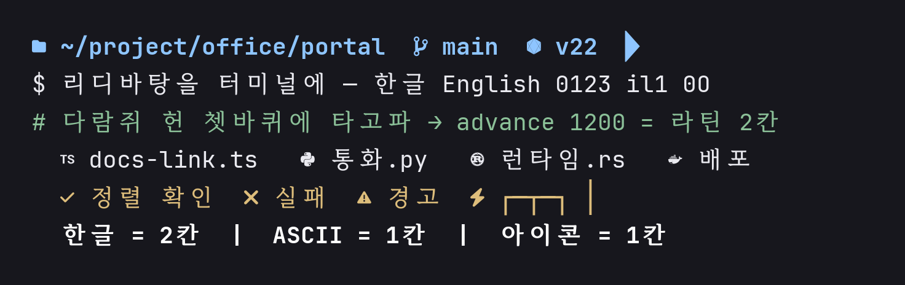
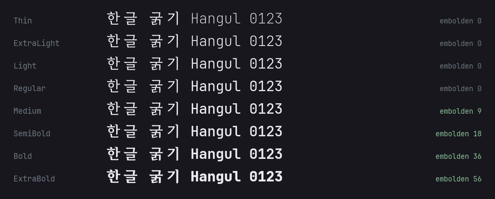
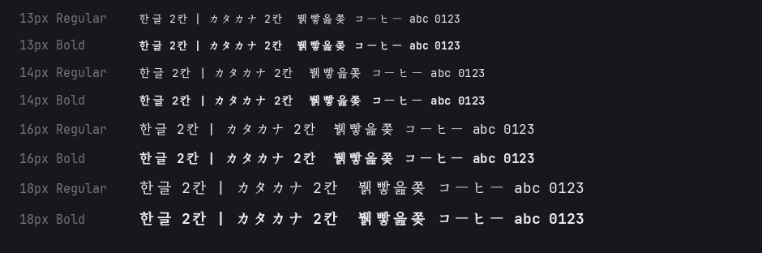

# JetBatang NF

[JetBrainsMono Nerd Font Mono](https://github.com/ryanoasis/nerd-fonts) 에
[RIDIBatang](https://ridicorp.com/) 한글을 합치는 재현 가능한 글꼴 빌드입니다.

라틴·기호·아이콘은 이미 Nerd Font 패치가 끝난 `JetBrainsMonoNerdFontMono` 에서,
한글과 가나는 RIDIBatang 에서 가져옵니다. 이 글자들은 라틴 1칸의 정확히 두 배
advance 에 맞춰 넣기 때문에 터미널 격자가 어긋나지 않습니다.

만들어지는 가족 이름은 `JetBatang NF` 입니다. 굵기 여덟 단계 × 정체·이탤릭,
모두 열여섯 종을 만듭니다.

**Alacritty (Regular / Bold)**


**굵기 여덟 단계**


**터미널 크기별**


## 왜 합치나

Alacritty 는 글꼴 폴백 목록이 없습니다. `family` 를 하나만 받고, Windows 에서는
DirectWrite 의 시스템 폴백이 동작하므로 한글에 어떤 글꼴이 쓰일지 지정할 수 없습니다.
그래서 한 파일로 합치는 방법밖에 없습니다.

합칠 때 걸리는 건 **글자 폭**입니다. 터미널은 한글을 정확히 2칸으로 세는데,
RIDIBatang 은 한글 advance 가 음절마다 922~963 으로 제각각입니다. 그대로 넣으면
격자가 어긋납니다. `build.py` 는 한글 advance 를 라틴 1칸의 정확히 2배(600 → 1200)로
못 박고 칸 중앙에 배치합니다.

## 설치

[Releases](../../releases) 에서 원하는 굵기의 `ttf` 를 받거나 `JetBatangNF-all.zip`
을 통째로 받습니다. 저장소 `fonts/` 에는 기본 네 종만 들어 있습니다.
설치한 뒤 터미널 글꼴을 `JetBatang NF` 로 지정하면 됩니다.

**Windows** — 저장소를 받아 아래를 실행하면 `fonts/` 에 있는 글꼴을 모두 설치합니다.

```powershell
powershell -ExecutionPolicy Bypass -File install-windows.ps1
powershell -ExecutionPolicy Bypass -File install-windows.ps1 -Uninstall
```

탐색기에서 우클릭 → 설치를 해도 됩니다. 다만 **파일 복사와 레지스트리 등록만
하는 방식은 쓰지 마세요.** 그렇게 하면 DirectWrite 가 글꼴 가족 목록에는 올리면서
파일로 연결하지 못해, 그 가족을 쓰려는 프로그램이 `GetFont` 에서
`DWRITE_E_FILENOTFOUND`(`0x88985003`) 를 받습니다. Alacritty 는 이때 죽습니다.

```
panicked at dwrote-0.11.5\src\font_family.rs:98:26:
called `Result::unwrap()` on an `Err` value: -2003283965
```

`install-windows.ps1` 은 `AddFontResourceW` 를 부르고 `WM_FONTCHANGE` 를 방송해서
실행 중인 세션도 글꼴을 알아보게 합니다.

**Linux** — `~/.local/share/fonts/` 에 넣고 `fc-cache -fv`

**macOS** — `~/Library/Fonts/` 에 넣기

**Alacritty** — `alacritty.toml`

```toml
[font.normal]
family = "JetBatang NF"
style = "Regular"

[font.bold]
family = "JetBatang NF"
style = "Bold"

[font.italic]
family = "JetBatang NF"
style = "Italic"
```

열여섯 종 모두 타이포그래픽 가족(nameID 16)은 `JetBatang NF` 하나입니다.
DirectWrite 와 fontconfig 는 이 이름으로 묶어 보여주므로

```toml
[font.normal]
family = "JetBatang NF"
style = "SemiBold"
```

처럼 쓰면 됩니다. GDI 처럼 한 가족에 네 칸만 두는 옛 방식으로 읽는 프로그램에서는
`JetBatang NF SemiBold` + `Regular` 로 잡힙니다. 아래 [굵기 구성](#굵기-구성)
표에 두 이름을 다 적어 두었습니다.

## 빌드

`fontTools` 만 있으면 됩니다. 재료는 스크립트가 알아서 받습니다.

```sh
pip install fonttools
./build.sh
```

결과는 `fonts/JetBatangNF-*.ttf` 열여섯 개입니다. 내려받은 재료와 기본 네 종을
제외한 결과물은 git 이 무시합니다.

환경변수로 조절합니다.

```sh
SCALE=1.05 YSHIFT=0 ./build.sh       # 한글을 5% 키우고 원래 높이로
EMBOLDEN_SCALE=1.25 ./build.sh       # 한글 굵기 증가량을 25% 더
FAMILY="MyBatang NF" ./build.sh      # 글꼴 이름 바꾸기
```

다른 Nerd Font 를 바탕으로 쓸 수도 있습니다.

```sh
NERD_FAMILY=CascadiaCode BASE_PREFIX=CaskaydiaCoveNerdFontMono ./build.sh
```

README 의 미리보기 이미지는 따로 만듭니다.

```sh
pip install pillow
python3 docs/make-preview.py
```

## 옵션

`build.py` 를 직접 부르면 한 종씩 세밀하게 조절할 수 있습니다.

| 옵션 | 기본값 | 설명 |
| --- | --- | --- |
| `--base` | (필수) | 라틴·아이콘을 담당할 Nerd Font Mono ttf |
| `--donor` | (필수) | `RIDIBatang.otf` |
| `--family` | `JetBatang NF` | 타이포그래픽 가족 이름 (nameID 16) |
| `--style` | `Regular` | 타이포그래픽 스타일. `SemiBold`, `Bold Italic` 등 (nameID 17) |
| `--scale` | `1.00` | 한글 배율. `1.00` 이 RIDIBatang 원본 크기 |
| `--yshift` | `60` | 한글 세로 이동. 바탕체는 받침이 깊어 라틴보다 낮게 앉는다 |
| `--shear-from-base` | 꺼짐 | base 의 `italicAngle` 만큼 한글도 기울인다 |
| `--embolden` | `0` | 한글 가로 굵기 증가량 |
| `--embolden-y` | `--embolden` × 0.75 | 한글 세로 굵기 증가량 |
| `--max-err` | `0.001` | 곡선 변환 허용오차(em 비율) |

## 굵기 구성

RIDIBatang 은 **세로획 80 짜리 한 굵기만** 제공합니다. 그래서 굵은 쪽은 한글
외곽선을 여덟 방향으로 조금씩 겹쳐 획을 불립니다. TrueType 은 nonzero winding
규칙이라 겹친 부분이 합집합으로 칠해집니다. 겹치는 판은 composite 글리프로
참조만 하므로 점 데이터가 늘지 않습니다.

Regular 보다 가는 쪽은 불릴 수 없습니다. **Thin·ExtraLight·Light 의 한글은
Regular 와 같은 굵기**이고, 라틴만 가늘어집니다.

| 굵기 | `style` (nameID 17) | 옛 방식 `family` + `style` | 파일 | 라틴 세로획 | 한글 세로획 |
| --- | --- | --- | --- | --- | --- |
| Thin | `Thin` / `Thin Italic` | `JetBatang NF Thin` + `Regular` / `Italic` | `JetBatangNF-Thin`, `-ThinItalic` | 50 | 82 |
| ExtraLight | `ExtraLight` / `ExtraLight Italic` | `JetBatang NF ExtraLight` + `Regular` / `Italic` | `JetBatangNF-ExtraLight`, `-ExtraLightItalic` | 66 | 82 |
| Light | `Light` / `Light Italic` | `JetBatang NF Light` + `Regular` / `Italic` | `JetBatangNF-Light`, `-LightItalic` | 79 | 82 |
| Regular | `Regular` / `Italic` | `JetBatang NF` + `Regular` / `Italic` | `JetBatangNF-Regular`, `-Italic` | 90 | 82 |
| Medium | `Medium` / `Medium Italic` | `JetBatang NF Medium` + `Regular` / `Italic` | `JetBatangNF-Medium`, `-MediumItalic` | 99 | 91 |
| SemiBold | `SemiBold` / `SemiBold Italic` | `JetBatang NF SemiBold` + `Regular` / `Italic` | `JetBatangNF-SemiBold`, `-SemiBoldItalic` | 108 | 100 |
| Bold | `Bold` / `Bold Italic` | `JetBatang NF` + `Bold` / `Bold Italic` | `JetBatangNF-Bold`, `-BoldItalic` | 125 | 117 |
| ExtraBold | `ExtraBold` / `ExtraBold Italic` | `JetBatang NF ExtraBold` + `Regular` / `Italic` | `JetBatangNF-ExtraBold`, `-ExtraBoldItalic` | 150 | 140 |

세로획 값은 1000 upem 기준이고 `한` 의 세로획을 잰 것입니다. 모든 종이
타이포그래픽 가족(nameID 16)으로는 `JetBatang NF` 하나이므로, nameID 16/17 을
읽는 프로그램에서는 굵기 열여섯 개가 한 가족으로 묶여 보입니다.

## 적용 범위

`JetBrainsMonoNerdFontMono` 만 씁니다. `JetBrainsMonoNerdFont`,
`JetBrainsMonoNerdFontPropo`, 합자 없는 `NL` 종류는 쓰지 않습니다. 바탕이 되는
글꼴이 이미 Nerd Font 패치본이라 이 저장소는 패치를 다시 돌리지 않습니다.

RIDIBatang 에서 가져오는 것은 터미널이 2칸으로 세는 구간뿐입니다.

| 구간 | 내용 |
| --- | --- |
| `U+AC00`–`U+D7A3` | 한글 완성형 |
| `U+3130`–`U+318F` | 한글 호환 자모 |
| `U+3041`–`U+309F` | 히라가나 |
| `U+30A0`–`U+30FF` | 가타카나 |
| `U+3000`–`U+303F` | CJK 문장부호 `。、「」〜` |
| `U+3200`–`U+32FF` | 괄호문자·원문자 `㈜ ㉠ ㎡` |
| `U+FF01`–`U+FF60` | 전각 영숫자·기호 |
| `U+FFE0`–`U+FFE6` | 전각 통화기호 `￦` |

나머지(라틴·그리스·키릴·괄호·수학기호·박스드로잉)는 base 쪽이 이미 고정폭이라
건드리지 않습니다.

RIDIBatang 에 없는 글자 하나는 같은 모양의 다른 글자로 때웁니다. 장음부호
`ー`(`U+30FC`)가 없어서 `―`(`U+2015`) 글리프를 씁니다. 둘 다 같은 높이·같은
굵기의 가로 전폭 막대입니다. 이게 없으면 `コーヒー` 가 `コ□ヒ□` 로 깨집니다.
`build.py` 의 `ALIASES` 에 적혀 있습니다.

## 눈으로 확인하기

다른 글꼴과 비교할 때는 같은 렌더러, 같은 크기, 같은 줄높이로 놓고 보세요.

```text
JetBatang NF 테스트 ABC abc 0123456789
가각간갇갈감갑값같꿇뷁힣
한글과 English 가 섞인 주석 한 줄
if (상태 === "완료") return "성공";
ㄱㄴㄷㅏㅑㅓㅕㅗㅛㅜㅠㅡㅣ
ひらがな カタカナ コーヒー データ サーバー
（）［］｛｝，．：；！？ ㈜ ㎡ ￦
```

## 알려진 한계

- **이탤릭 한글은 가짜 이탤릭**입니다. base 의 기울기만큼 기울인 것입니다.
- 13px 아래에서는 굵은 쪽 한글의 속공간이 메워집니다. `뷁` 처럼 획이 많은
  글자가 먼저 뭉갭니다.
- 한자가 없습니다. RIDIBatang 에 한자 글리프가 없습니다.
- 가나 중 `ゔ ゕ ゖ ゛ ゜ ゝ ゞ ヷ ヸ ヹ ヺ ヽ ヾ` 등 열아홉 자가 없습니다.
  RIDIBatang 이 히라가나 83 자, 가타카나 87 자만 제공합니다. 자주 쓰는
  장음부호 `ー` 는 `―` 로 때웠습니다.
- 힌팅이 없습니다. 아주 작은 크기에서는 명조 특유의 획 대비가 뭉갭니다.

## 라이선스

[SIL Open Font License 1.1](LICENSE). 두 원본 글꼴 모두 같은 license 입니다.

- **JetBrains Mono** — Copyright 2020 The JetBrains Mono Project Authors
- **Nerd Fonts** — Ryan L McIntyre and contributors
- **RIDIBatang** — Copyright (c) 2019 RIDI & Sandoll, 산돌 디자인

"JetBrains Mono" 는 JetBrains s.r.o. 의, "RIDIBatang" 은 리디주식회사의 상표입니다.
이 저장소는 두 회사와 아무 관계가 없으며, 만들어지는 글꼴 이름에도 두 상표를
쓰지 않습니다.
