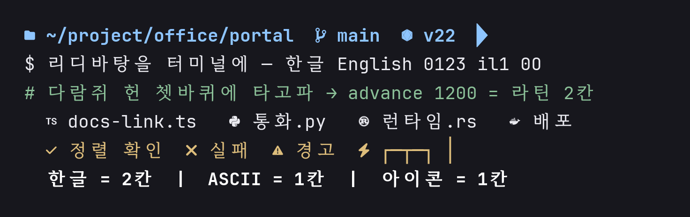
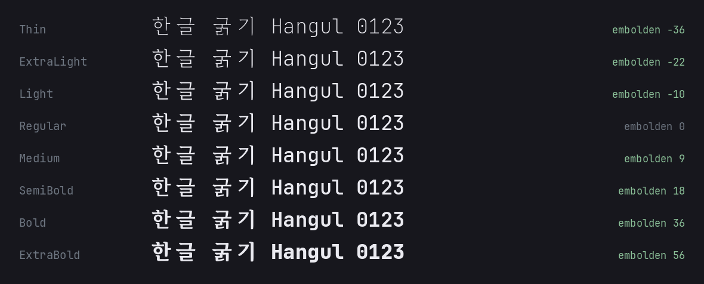
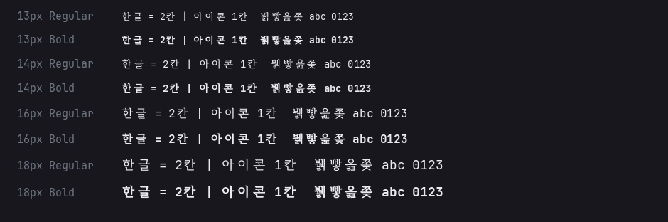

# JetBatang NF

터미널에서 쓰는 한글 명조 글꼴이에요. [JetBrainsMono Nerd Font Mono](https://github.com/ryanoasis/nerd-fonts) 의
라틴·기호·아이콘에 [RIDIBatang](https://ridicorp.com/ridibatang/) 의 한글·가나를 얹었어요.
한글 글자폭은 라틴의 정확히 두 배(1200/600)로 고정해서, 한글을 섞어 써도 격자가 어긋나지 않아요.
굵기 여덟 단계에 정체와 이탤릭을 더해 모두 열여섯 종이에요.







```text
JetBatang NF 테스트 ABC abc 0123456789
가각간갇갈감갑값같꿇뷁힣
한글과 English 가 섞인 주석 한 줄
if (상태 === "완료") return "성공";
ㄱㄴㄷㅏㅑㅓㅕㅗㅛㅜㅠㅡㅣ
ひらがな カタカナ コーヒー データ サーバー
（）［］｛｝，．：；！？ ㈜ ㎡ ￦
※ 주의 ① ② ③ ★ ☆ Ⅳ 25℃ ₩1,000
```

## INSTALL

[Releases](../../releases) 에서 원하는 굵기의 `ttf` 나 `JetBatangNF-all.zip` 을 받으세요.
설치한 뒤 터미널에서 글꼴 이름을 `JetBatang NF` 로 지정하면 돼요. 저장소에는 글꼴 파일이 없어요.
설치한 판은 글꼴 정보의 버전(`Version 1.6.0`)이 릴리스 태그와 같은지로 확인하세요. v1.4.0 이하는 버전이 비어 있어요.

**Windows**

Windows Terminal 에서는 받은 `ttf` 를 선택해 우클릭 → **모든 사용자용으로 설치** 를 권장해요.
관리자 승인이 필요해요. 사용자 전용 글꼴 설치에는
[Windows 의 알려진 글꼴 처리 문제](https://github.com/microsoft/terminal/issues/19707)가 있어서,
글꼴 파일을 읽지 못하거나 Terminal 이 종료될 수 있어요. 이미 현재 사용자용으로 설치했다면 기존
JetBatang NF 를 먼저 제거해 같은 글꼴이 두 위치에 중복 등록되지 않게 하세요.

아래 스크립트는 **현재 사용자 계정용** 설치·제거에만 써요. 모든 사용자용으로 설치한 글꼴은
Windows 글꼴 설정에서 관리하세요.

`JetBatangNF-all.zip` 을 풀고, 푼 폴더에서 실행하세요. 같은 폴더에 있는 `JetBatangNF-*.ttf` 를 모두
설치해요. 몇 종만 받았다면 Releases 의 `install-windows.ps1` 도 받아 `ttf` 와 같은 폴더에 두세요.
저장소에서 직접 빌드했다면 루트에서 실행하세요. 각 파일은 스크립트 옆을 먼저 보고, 없으면 `fonts/` 에서 찾아요.
루트에 같은 이름의 예전 `ttf` 가 있으면 그 파일을 우선 설치하니, 새 빌드를 설치할 때는 예전 파일을
다른 폴더로 옮긴 뒤 실행하세요.

```powershell
powershell -ExecutionPolicy Bypass -File install-windows.ps1
powershell -ExecutionPolicy Bypass -File install-windows.ps1 -Uninstall
```

설치가 끝나면 터미널을 완전히 종료한 뒤 다시 열어 주세요. WPF 앱에서 글꼴 가족 목록을 읽을 때
`FileNotFoundException` 이 나면 조회 중 파일을 찾지 못한 것이지, 글꼴 파일이 불량이라는 뜻은
아니에요. 등록된 글꼴의 경로와 중복 설치 여부를 확인하세요.

파일 복사와 레지스트리 등록만 하는 설치 방식은 쓰지 마세요. 탐색기의 글꼴 설치 기능이나 위
스크립트로 글꼴을 등록해야 실행 중인 세션에도 설치 사실을 알릴 수 있어요.

**Linux** — `~/.local/share/fonts/` 에 넣고 `fc-cache -fv`

**macOS** — `~/Library/Fonts/` 에 넣기

**WSL** — Windows Terminal 이나 Windows 판 VS Code 로 WSL 을 쓰면 글꼴은 **Windows 쪽**에 설치하세요.
WSL 의 `~/.local/share/fonts/` 에만 넣어도 Windows 프로그램에는 보이지 않아요. WSL 안에서 실행하는
Linux GUI 프로그램에 쓸 때만 위 Linux 설치 방법을 따라요.

## WEIGHTS

| 굵기 | `style` | 파일 | 라틴 세로획 | 한글 세로획 |
| --- | --- | --- | --- | --- |
| Thin | `Thin` / `Thin Italic` | `JetBatangNF-Thin`, `-ThinItalic` | 50 | 46 |
| ExtraLight | `ExtraLight` / `ExtraLight Italic` | `JetBatangNF-ExtraLight`, `-ExtraLightItalic` | 66 | 61 |
| Light | `Light` / `Light Italic` | `JetBatangNF-Light`, `-LightItalic` | 79 | 72 |
| Regular | `Regular` / `Italic` | `JetBatangNF-Regular`, `-Italic` | 90 | 82 |
| Medium | `Medium` / `Medium Italic` | `JetBatangNF-Medium`, `-MediumItalic` | 99 | 90 |
| SemiBold | `SemiBold` / `SemiBold Italic` | `JetBatangNF-SemiBold`, `-SemiBoldItalic` | 108 | 100 |
| Bold | `Bold` / `Bold Italic` | `JetBatangNF-Bold`, `-BoldItalic` | 125 | 118 |
| ExtraBold | `ExtraBold` / `ExtraBold Italic` | `JetBatangNF-ExtraBold`, `-ExtraBoldItalic` | 150 | 138 |

표의 세로획 값은 1000 upem 기준으로 `한` 의 세로획을 잰 거예요.

앱이 가족과 굵기를 따로 고르게 하면 가족 이름은 모든 굵기에서 `JetBatang NF` 예요.
위 표의 굵기와 이탤릭 여부를 앱 설정에서 골라요. Windows 의 GDI 방식처럼 가족 하나에
Regular·Italic·Bold·Bold Italic 네 칸만 있는 앱에서는 아래 가족 이름을 써요.

| 쓰려는 굵기 | GDI 방식 앱의 가족 이름 | 앱에서 고를 스타일 |
| --- | --- | --- |
| Thin | `JetBatang NF Thin` | Regular / Italic |
| ExtraLight | `JetBatang NF ExtraLight` | Regular / Italic |
| Light | `JetBatang NF Light` | Regular / Italic |
| Regular | `JetBatang NF` | Regular / Italic |
| Medium | `JetBatang NF Medium` | Regular / Italic |
| SemiBold | `JetBatang NF SemiBold` | Regular / Italic |
| Bold | `JetBatang NF` | Bold / Bold Italic |
| ExtraBold | `JetBatang NF ExtraBold` | Regular / Italic |

예를 들어 Medium 이 목록에서 따로 뜨는 앱에는 `JetBatang NF Medium` 을 넣어요.
굵기를 따로 고르는 앱에서는 `JetBatang NF` 와 Medium 을 고르면 돼요.

RIDIBatang 은 세로획 82 짜리 한 굵기밖에 없어요. 그래서 한글 세로획이 같은 굵기 라틴의 0.91 배쯤
(Regular 의 82 : 90) 되도록 굵기마다 한글 획을 불리거나 깎아요. Medium 부터는 한글 외곽선을 여덟
방향으로 겹쳐 획을 불린 다음, 겹친 외곽선을 하나로 합쳐요. Light 부터 가는 쪽은 여덟 방향으로 옮긴
외곽선이 모두 겹치는 곳만 남겨 획을 깎아요. 양은 가로 방향을 기준으로 잡고, 세로 방향은 불릴 때
0.4 배, 깎을 때 0.8 배를 줘요. RIDIBatang 은 가로획(67)과 세로획(82)의 차이가 작아서, 가로획을
덜 깎으면 Thin 에서 가로획이 세로획보다 굵어져요. 깎다가 가는 획이 끊기거나 사라지는 `㎡ 『 ぁ`
같은 글자는 덜 깎아요.

## COVERAGE

베이스 글꼴은 `JetBrainsMonoNerdFontMono` 하나만 써요. RIDIBatang 에서 가져오는 건
터미널이 2칸으로 세는 구간, `₩`, 베이스에 없는 KS X 1001 기호예요. NFD 에 필요한 현대 한글
자모와 가나의 결합점도 기존 RIDIBatang 외곽선을 재사용해 만들어요. 나머지는 베이스를 그대로 둬요.

| 구간 | 내용 |
| --- | --- |
| `U+AC00`–`U+D7A3` | 한글 완성형 |
| `U+3130`–`U+318F` | 한글 호환 자모 |
| `U+1100`–`U+1112`, `U+1161`–`U+1175`, `U+11A8`–`U+11C2` | 현대 한글 첫가끝 자모 67자 |
| `U+3041`–`U+309F` | 히라가나 |
| `U+3099`–`U+309A` | 가나 결합 탁점·반탁점, 글자폭 0 |
| `U+30A0`–`U+30FF` | 가타카나 |
| `U+3000`–`U+303F` | CJK 문장부호 `。、「」〜` |
| `U+3200`–`U+32FF` | 괄호문자·원문자 `㈜ ㉠` |
| `U+3300`–`U+33FF` | CJK 호환 문자 `㎡ ㎏ ㎞` |
| `U+FF01`–`U+FF60` | 전각 영숫자·기호 |
| `U+FFE0`–`U+FFE6` | 전각 통화기호 `￦` |

RIDIBatang 에는 장음부호 `ー`(`U+30FC`) 가 없어요. 그대로 두면 `コーヒー` 가 `コ□ヒ□` 로
깨지기 때문에, 모양이 같은 `―`(`U+2015`) 를 대신 써요. 또 `￦`(`U+FFE6`) 에는 전각 역슬래시 모양이
걸려 있어서 `₩`(`U+20A9`) 모양을 대신 써요. 둘 다 `build.py` 의 `ALIASES` 에 있어요.

`₩ ℃ ℉` 와 로마 숫자 `Ⅰ`–`Ⅹ` `ⅰ`–`ⅹ` 는 터미널이 1칸으로 세는데 베이스에 없어요. RIDIBatang 것을
베이스 대문자 높이로 키워 `W` 자리 가운데에 넣고, `W` 보다 넓은 `₩ ℃ Ⅷ` 같은 글자는 가로만 줄여요.
한글처럼 올려 앉히지 않고 기준선에 맞춰서 `25℃` `Ⅳ.` 가 숫자·마침표와 나란해요. `build.py` 의 `NARROW` 에 있어요.
굵기를 바꿀 때는 가로로 줄인 비율만큼 덜 불리거나 덜 깎아요. 원래 폭에서 굵기를 바꾼 다음 가로로
줄인 것과 같은 모양이라, ExtraBold 에서도 `Ⅷ` 의 획 다섯이 붙지 않아요. 그 대신 줄인 글자의 세로획은
같은 굵기의 라틴보다 조금 가늘어요. 가는 판에서는 깎기 전 잉크를 `W` 자리에 맞춰서, 깎은 만큼 조금 좁아요.

한국어 문서에 자주 나오는 `※ ① ★ ⑴ ⓐ ⅓ ‥` 같은 KS X 1001 기호는 폭이 애매해서, 터미널이 기본값으로
1칸에 세요. 베이스에 없는 것은 RIDIBatang 에서 가져와 1칸 가운데에 베이스 `○` 크기로 줄여 넣어요.
세로 가운데가 한글과 같아서 `①` 과 `㉠` 이 한 줄에 나란하고, 이탤릭에서도 베이스 `○ ●` 처럼 세워 둬요.
터미널에서 애매한 폭을 2칸으로 세게 바꿨다면 왼쪽 칸에 그려져요. `build.py` 의 `ksx1001_symbols` 가
골라요. 옴 기호(`U+2126`)·옹스트롬 기호(`U+212B`)·`―`(`U+2015`) 는 베이스의 `Ω` `Å` `—` 를 그대로
써요. `BASE_ALIASES` 에 있어요.
굵은 판에서는 줄인 비율만큼 덜 불려요. 그래도 `⑫` 의 숫자가 원에 붙거나 `⑧` 의 속공간이 막히면
더 덜 불려서, 획이 서로 붙지 않고 속공간 수가 Regular 와 같아요. `⑬ ⒀` 은 ExtraBold 에서 조금만
불려도 숫자가 원에 붙어서 Regular 굵기 그대로예요. 가는 판에서는 깎지 않아요. 줄여 넣어
획이 이미 Light 라틴보다 가늘어서, 한글만큼 깎으면 Thin 에서 `①` 의 원이 거의 사라져요.

탁음 가나 `ゔ ヷ ヸ ヹ ヺ` 도 RIDIBatang 에 없어요. `ヴ` 에서 탁점 두 획을 떼어 `う ワ ヰ ヱ ヲ` 에
얹어 만들어요. 탁점 자리를 내려고 청음 글자를 `ヴ` 가 `ウ` 를 옮긴 만큼 옮겨요. `build.py` 의 `VOICED` 에 있어요.
작은 히라가나 `ゕ ゖ` 와 띄어 쓰는 탁점·반탁점 `゛ ゜` 도 없어서 만들어요. `ゕ ゖ` 는 `か け` 를 원본
`ヵ ヶ` 가 `カ ケ` 보다 작은 만큼(0.81 배) 줄여 내리고, `゛ ゜` 는 결합 탁점·반탁점과 같은 모양을
칸 왼쪽 위에 그려요. 앞 글자 오른쪽 위에 붙어 보이게 하는 일본어 글꼴의 관례예요. `SMALL` 과
`SPACING_MARKS` 에 있어요.

macOS 파일 이름처럼 NFD 로 분리된 `한글` 과 `が` `ぱ` 도 지원해요. 자모와 결합점에
글리프가 있어 앱이 글자별로 글꼴을 고를 때 다른 글꼴로 넘어가지 않고, OpenType `ccmp` 로 기존
완성형 `한글` `が` `ぱ` 글리프에 조합해 같은 모양과 두 칸 폭으로 그려요. 현대 한글 11,172음절의
NFD 를 지원하고, 호환 자모 `ㄱㅏ` 는 조합하지 않아요. 원본의 라틴 리거처·조합 기능은 유지해요.

베이스의 `⚡`(`U+26A1`) `﹢`(`U+FE62`) 는 터미널이 2칸으로 세는데 1칸 폭으로 그려져 있어요.
그래서 2칸 가운데로 옮겨요. `☰`(`U+2630`) 는 Unicode 16 부터 2칸이지만, 아직 1칸으로 세는
터미널에서 옆 글자를 덮지 않게 그대로 둬요. `build.py` 의 `WIDEN` 에 있어요.

## LIMITATIONS

- 13px 아래에서는 굵은 쪽 한글의 속공간이 메워져요. `뷁` 같은 글자부터 뭉개지기 시작해요.
- 가는 판에서 `퐪` `뛌` `챟` `㎯` 처럼 획이 아주 가늘게 이어진 글자 열네~열여덟 자는 조금만 깎아도
  획이 끊기거나 속공간이 터져서 Regular 굵기 그대로예요.
- 한자가 없어요. 원본인 RIDIBatang 에 한자 글리프가 없어서예요.
- 가나 중 `ゝ ゞ ヽ ヾ ゟ ゠ ヿ` 일곱 자가 빠져 있어요. RIDIBatang 에 만들 재료가 되는 글자가 없어요.
- 옛한글 자모는 지원하지 않아요. NFD 조합에는 OpenType 조합을 처리하는 렌더러가 필요해요.
  글자를 하나씩 따로 그리는 앱에서는 글꼴만으로 자모를 완성형으로 묶을 수 없어요.
- KS X 1001 의 라틴 글자 `IJ ij ⁿ ː` 는 넣지 않았어요. 명조로 그리면 베이스 라틴 옆에서 튀어서,
  터미널이 다른 글꼴로 그려요.
- 라틴·숫자·괘선은 JetBrains Mono 의 힌팅을 그대로 쓰지만, 한글·가나와 RIDIBatang 에서 가져온 기호,
  Nerd Font 아이콘에는 힌팅이 없어요. 그래서 힌팅을 쓰는 환경(Windows 등)에서 작은 크기로 보면
  한글이 라틴보다 흐릿하고, 명조 특유의 획 대비가 뭉개져요.

## BUILD

`fontTools` 와 `skia-pathops` 가 필요해요. 원본 글꼴은 스크립트가 알아서 내려받아요.

```sh
pip install fonttools skia-pathops
VERSION=1.6.0 ./build.sh
```

`VERSION` 은 글꼴 정보에 찍히는 버전이라 꼭 넘겨야 해요. 릴리스 태그(`v1.6.0`)와 같은 값을 쓰세요.
빠졌거나 `X.Y.Z` 꼴이 아니면 원본을 내려받기 전에 멈춰요. 기본값에 기대어 이전 버전으로 빌드하는
일을 막으려고 매번 릴리스 버전을 직접 지정하게 했어요. 이전 값을 다시 넘기는 것까지 막지는 못해요.
글꼴 내부 버전값의 표현 범위 때문에 `Y`·`Z` 는 0~99, 버전의 상한은 `327.67.99` 예요.

결과는 `fonts/JetBatangNF-*.ttf` 열여섯 개예요. 빌드한 다음 아래 명령으로 회귀 검사를 돌려요.
`uharfbuzz` 는 검사에서 NFD 문자열을 실제로 조합하는 데 쓰고, 글꼴 빌드에는 필요하지 않아요.
굵기 검사는 기본값으로 빌드했다고 보고 재요. `EMBOLDEN_SCALE` 같은 빌드 값을 바꾸면 실패할 수 있어요.

```sh
pip install uharfbuzz
python3 -m unittest discover tests
```

빌드 값을 바꿀 때도 `VERSION` 은 같이 넘겨요.

```sh
VERSION=1.6.0 SCALE=1.05 YSHIFT=0 ./build.sh     # 한글을 5% 키우고 원래 높이로
VERSION=1.6.0 EMBOLDEN_SCALE=1.25 ./build.sh     # 한글 굵기 증가량(가는 판은 깎는 양)을 25% 더
VERSION=1.6.0 JOBS=4 ./build.sh                  # 동시에 만드는 굵기 수 줄이기(기본은 CPU 수)
VERSION=1.6.0 FAMILY="MyBatang NF" ./build.sh    # 글꼴 이름 바꾸기

# 바탕 Nerd Font (기본값)
VERSION=1.6.0 NERD_FAMILY=JetBrainsMono BASE_PREFIX=JetBrainsMonoNerdFontMono ./build.sh
```

한 종씩 세밀하게 조절하려면 `python3 build.py --help` 를 보세요.

Releases 에 올릴 파일은 `./package.sh` 로 `dist/` 에 만들어요. `JetBatangNF-all.zip` 에는 글꼴과
`install-windows.ps1`, `LICENSE` 가 함께 들어가고, 낱개 `ttf` 와 `install-windows.ps1` 도 따로 나와요.
`dist/` 의 파일을 모두 올리세요.

## LICENSE

[SIL Open Font License 1.1](LICENSE). 원본 글꼴 두 개 모두 같은 라이선스예요.

- **JetBrains Mono** — Copyright 2020 The JetBrains Mono Project Authors
- **Nerd Fonts** — Ryan L McIntyre and contributors
- **RIDIBatang** — Copyright (c) 2019 RIDI & Sandoll, 산돌 디자인
